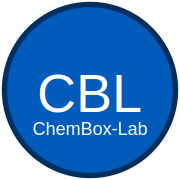

<p align="center">
  
</p>

# ChemBox-Lab

## Atmospheric Chemistry Box Modeling with KPP + BOXMOX


A practical, hands-on guide to building and running atmospheric chemistry **box models** using **KPP** (Kinetic PreProcessor) and **BOXMOX**.
This repository is designed to take you from zero to fully working simulations, with clear examples and organized chapters.

---

## 📌 What’s Inside

✅ Introduction to box models

✅ How KPP generates chemistry solvers

✅ How BOXMOX uses those solvers in simulations

✅ Step-by-step tutorials with increasing complexity

✅ Realistic chemical schemes and multi-scenario examples

You’ll find:

* **Basic KPP mechanism setup**
* Writing `.eqn` files from scratch
* KPP compilation and solver generation
* Linking KPP outputs with BOXMOX
* Running simulations with different reaction schemes
* Visualizing and analyzing results

---

## 📂 Repository Structure

```
boxmodel-kpp-boxmox/
│
├── README.md
├── LICENSE
├── mkdocs.yml                 # Docs configuration
│
├── docs/                      # MkDocs documentation
│   │
│   ├── index.md               # Home page
│   │
│   ├── tutorials/             # Learning content / chapters
│   │   ├── 01_intro_box_model.md
│   │   ├── 02_kpp_basics.md
│   │   ├── 03_eqn_files.md
│   │   ├── 04_run_simple_box_model.md
│   │   ├── 05_complex_mechanisms.md
│   │   └── 06_boxmox_workflow.md
│   │
│   ├── examples/              # Example workflows in docs
│   │   ├── simple_NOx_example.md
│   │   ├── isoprene_chemistry.md
│   │   └── urban_air_pollution.md
│   │
│   └── references.md          # Citations/manual links
│
├── mechanisms/                # Real input data (not docs)
│   └── *.eqn
│
├── boxmox_projects/           # BOXMOX simulation setups
│   └── project_01/
│
└── scripts/                   # Helper tools
    ├── run_boxmodel.sh
    └── plot_results.py
 
```

---

## 🚀 Getting Started

### Requirements

* Python 3.x (for plotting/processing)
* BoxModel (BOXMOX)
* KPP installed and working on your machine
* Standard build tools: `gcc`, `make`, etc.

### Quick Start

```bash
git clone https://github.com/nidhispace/ChemBox-Lab.git
cd ChemBox-Lab/

# Example: Compile a simple mechanism
cd docs/examples/simple_NOx_example/
make
./boxmodel
```

Then open the output results in your plotting tool of choice (example Python script included).

---

## 🧪 Example Applications

* NOx chemistry under sunlight
* Isoprene oxidation scheme
* VOC + NOₓ pollution scenario
* Sensitivity analysis and emission perturbations

More examples will be added over time.

---

## 🎯 Goal of This Project

To create a **clear, accessible** learning resource for:

* Students starting with atmospheric chemistry modeling
* Researchers needing quick reference setups
* Anyone wanting to test chemistry schemes without full 3-D models

---

## ✅ Status

📚 Still under Development

---

## 📬 Contact

If you have questions or suggestions, feel free to open an issue.

---
